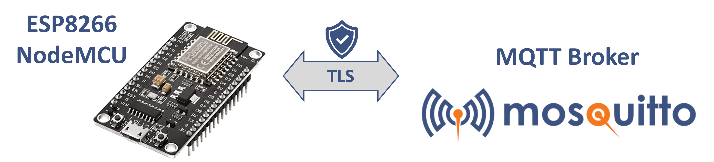
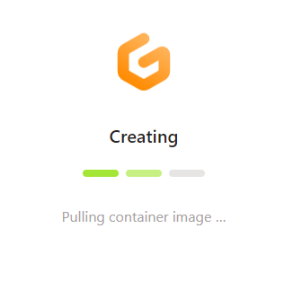
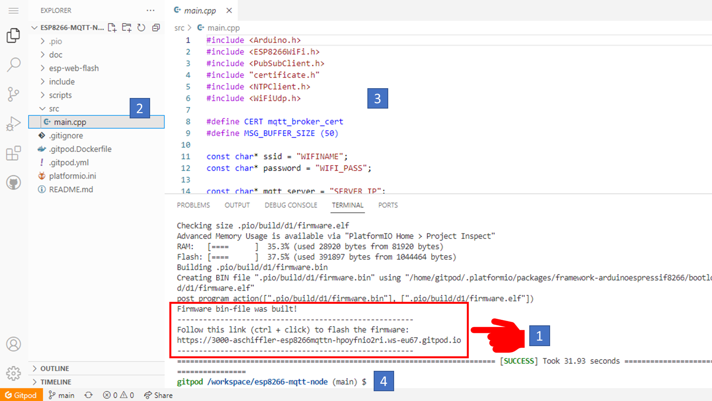
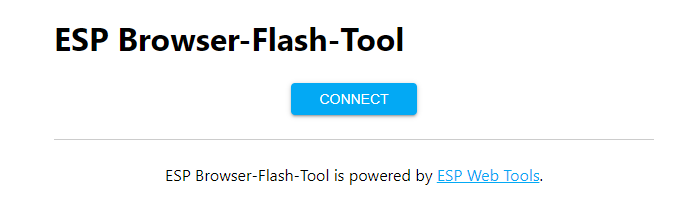

Quickstart 👇  Coding in the browser; Web-based flash-tool is included.

[](https://gitpod.io/#https://github.com/aschiffler/esp8266-mqtt-node)

# Introduction for the esp8266-mqtt-node
This repository holds a sample code and a corresponding platformIO project using the Arduino Framework to connect an esp8266 dev board to a mqtt broker.
The code is for demonstration purposes and directly uses hardcoded connection settings and credentials. So you have to customize at least the following lines in [main.cpp, lines 11-18](blob/main/src/main.cpp) to use the code:
```c
//#define MQTT_TLS // uncomment this define to enable TLS transport
//#define MQTT_TLS_VERIFY // uncomment this define to enable broker certificate verification
const char* ssid = "YOUR-WIFI";
const char* password = "YOUR-WIFI-PSK";
const char* mqtt_server = "BROKER"; // eg. your-demo.cedalo.cloud or 192.168.1.11
const uint16_t mqtt_server_port = 1883; // or 8883 most common for tls transport
const char* mqttUser = "user";
const char* mqttPassword = "pass";
const char* mqttTopicIn = "esp-8266-in";
const char* mqttTopicOut = "esp-8266-out";
```
For the variable ```mqtt_server``` use either an ipv4 address or a domain name. Only ```tcp``` transport is supported (no WebSocket).
A detailed tutorial is available [here](https://cedalo.com/blog/)



# Overview
Various ESP8266 development boards exist and can be used to realize for example small and smart IoT applications (like [this](https://github.com/lumapu/ahoy)). The microcontroller needs to be flashed with a corresponding firmware to realize the application. 
Principal steps
1. Write and compile c/c++ code
2. Create the flashable firmware
3. Flash the firmware and test the application

## Quickstart: Use gitpod for browser-integrated development
For the steps sketched above you will need a IDE like Micorosft VSCode, the needed software frameworks, and libraries.
The setup of all this is already prepared here in this repository using gitpod. The only thing you need is a github account.

Click here 👇 to start your development environment.

[](https://gitpod.io/#https://github.com/aschiffler/esp8266-mqtt-node)

If you dislike using gitpod, follow the instructions to install and use the platformIO project within VSCode and clone this repository. (see as reference: [link](https://randomnerdtutorials.com/vs-code-platformio-ide-esp32-esp8266-arduino/))

## How to use gitpod
After starting the instance it takes a minute to be ready



If the environment is ready it will look like the following image.

During the startup, the code is automatically compiled and the firmware is created. In the output area marked by 1️⃣ below, you will find the information about the build process and a link to a webpage where you can flash the firmware to your esp8266 development board.



### [Flash the firmware](#flash)
The successfully built firmware file will be in the folder ```esp-web-flash```  and is named ```firmware.bin```.
You can use the gitpod environment where a browser-based flash tool is integrated. Just follow the link marked by 1️⃣ (see above) and another tab will open:



Click connect and flash the firmware.

### [Adjust, improve or extend the code](#edit)
Open the main source file ```main.cpp``` from folder ```src``` 2️⃣ do your edits and save the file 3️⃣. Then type in terminal 4️⃣ the command **```pio run```**. This shall start the compilation and the creation of the firmware. If successful you can go to the above section [Flash the firmware](#flash) to upload your modified firmware to your device.
